#LQRWeChat

	本项目高仿微信6.3.31，使用网易云信SDK 3.2.0版本完成主要的聊天功能（单聊、群聊）、好友关系管理、群组管理等功能。

该高仿微信项目是本人大学最后的一个练手项目（主要也是因为没找到工作，不想荒废自己的能力，哈哈~~），我会尽可能的将它做完整，并做到跟微信样式尽可能一致，但其实把它做完整并不是最重要的，重要的是在开发这个项目的过程中学习到的知识和抽取出其它项目可以直接使用的开源库。因为我做过好几个项目后发现总有一些东西在这个项目用到了，在另一个项目也会用到，总是这样复制粘贴不仅效率不高，还会让开发乏味，所以，我希望通过该项目及以后的其他项目开发，将一些通用的东西一个个抽取出来，让包括我在内的各位安卓工程师可以高效清爽的编码。此外，这里要感谢“开源中国”对我发布的开源项目的支持，给了我很大的鼓励，谢谢，我今后还会不断做一些开源的项目出来的**（本说明最后有为该项目而开发的开源库）**。好了，以下是项目界面及功能介绍：

## 应用demo下载：[DemoApp.apk](https://git.oschina.net/CSDNLQR/LQRWeChat/raw/master/app-debug.apk)
不提供注册，目前已有可用账号如下：

***因为前期主要开发聊天等IM功能，没有做手机号注册，同时也为了开发方便，所以在登录时不用手机号登录，请不要在意这些细节~**

<table>
    <tr>
        <th>用户名</th>
		<th>账号</th>
        <th>密码</th>
    </tr>
    <tr>
        <th>大娃</th>
        <th>dawa</th>
        <th>123456</th>
    </tr>
    <tr>
        <th>二娃</th>
        <th>erwa</th>
        <th>123456</th>
    </tr>
    <tr>
        <th>三娃</th>
        <th>sanwa</th>
        <th>123456</th>
    </tr>
    <tr>
        <th>四娃</th>
        <th>siwa</th>
        <th>123456</th>
    </tr>
    <tr>
        <th>五娃</th>
        <th>wuwa</th>
        <th>123456</th>
    </tr>
    <tr>
        <th>六娃</th>
        <th>liuwa</th>
        <th>123456</th>
    </tr>
    <tr>
        <th>七娃</th>
        <th>qiwa</th>
        <th>123456</th>
    </tr>
</table>

## 目录
* [一、主界面](#一主界面)
	* [菜单](#菜单)
	* [最近消息](#最近消息)
	* [通讯录](#通讯录)
	* [发现](#发现)
	* [个人](#个人)
* [二、好友、群组](#二、好友、群组)
	* [好友](#好友)
	* [群组](#群组)
* [三、聊天功能](#三、聊天功能)
	* [支持的消息类型](#支持的消息类型)
	* [语音](#语音)
	* [小视频](#小视频)
	* [图片](#图片)
* [四、之后版本将要实现的功能](#四、之后版本将要实现的功能)
* [五、为该项目而开发的开源库](#五、为该项目而开发的开源库)

#一、主界面

##菜单
1. 发起群聊
	1. 跳转到“发起群聊”界面
2. 添加朋友
	1. 跳转到“添加朋友”界面
3. 扫一扫
	1. 跳转到“扫一扫”界面
4. 帮助与反馈
	1. 跳转到微信帮助与反馈页面

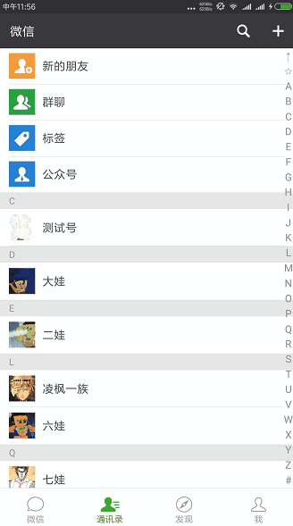

##最近消息
1. 接收并显示最近的群聊消息
2. 接收并显示最近的好友聊天消息
3. 底部小红点提示（新的未读消息数量）

##通讯录
1. 好友列表显示
2. 新的朋友
3. 群聊
4. 底部小红点提示（新好友，新群聊）

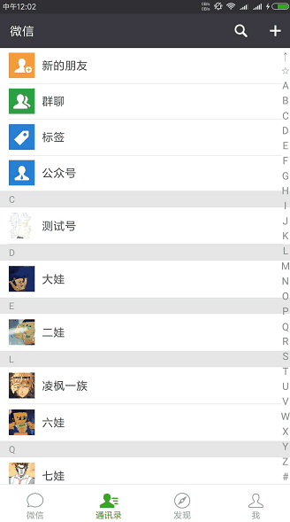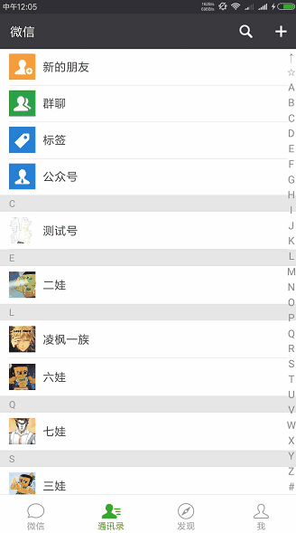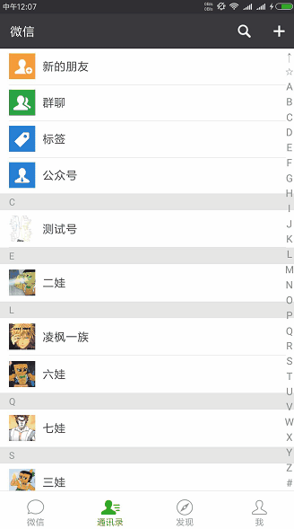

##发现
1. 朋友圈（未完成）
2. 扫一扫
	1. 支持扫描二维码名片添加好友
	2. 支持从相册中选取要扫描的二维码
3. 摇一摇（未完成）
4. 附近的人
	1. 只完成“附近的人”的界面布局和提示，没有功能。
5. 购物
	1. 跳转京东首页
6. 游戏
	1. 跳转4399首页

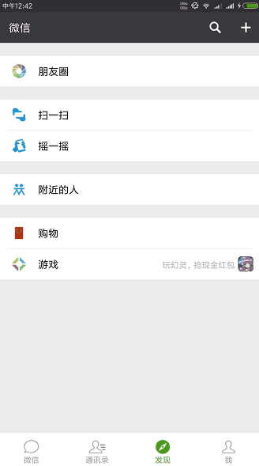

##个人
1. 个人信息
	1. 头像查看修改
	2. 昵称修改
	3. 二维码名片查看
	4. 性别修改
	5. 个人签名修改
2. 相册（未完成）
3. 收藏（未完成）
4. 钱包（未完成）
5. 卡包
	1. 只完成“卡包”的多个界面布局和提示，没有功能。
6. 表情（未完成）
7. 设置
	1. 新消息提醒
	2. 勿扰模式
	3. 聊天
	4. 隐私
	5. 通用
	6. 账号与安全
	7. 关于
	8. 退出

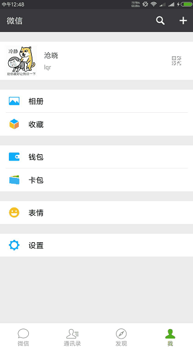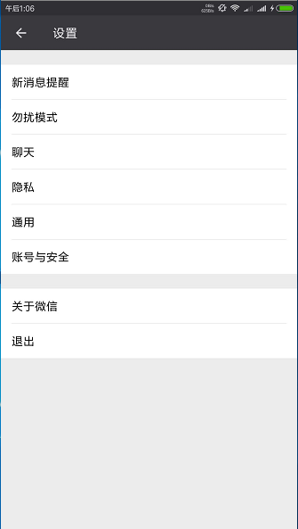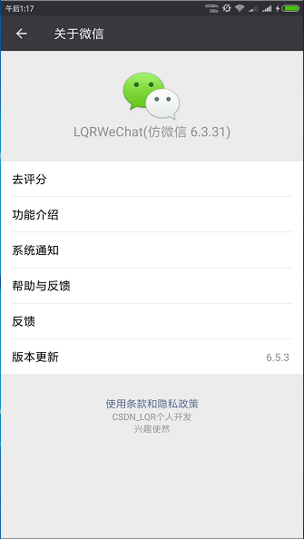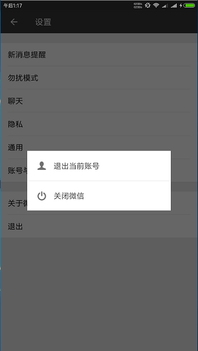
#二、好友、群组

##好友
1. 查找好友
	1. 查找已添加好友
	2. 查找未添加好友
2. 添加好友
3. 修改好友昵称
4. 删除好友
5. 拉黑好友

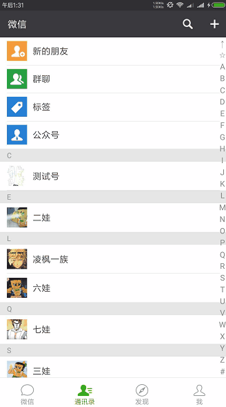

##群组
1. 创建群
2. 拉人入群
3. 踢人出群
4. 修改群名片
5. 查看群二维码
6. 群公告（可查看、发布）
7. 修改我在群中的昵称
8. 显隐群成员昵称
9. 退出群组

#三、聊天功能

##支持的消息类型
1. 文本消息
2. 小视频消息（上传、下载、播放）
3. 图片消息（上传、下载、查看）
4. 表情消息
5. 贴图消息（目前只支持静态图片）
6. 语音消息（上传、下载、播放）
7. 位置消息（未完成）

##语音
1. 长按录音（默认10秒）
2. 上滑取消录音

##小视频
1. 长按录视频（默认10秒）
2. 上滑取消视频录制

##图片
1. 仿微信图片选择界面
2. 支持原图及压缩图片后发送

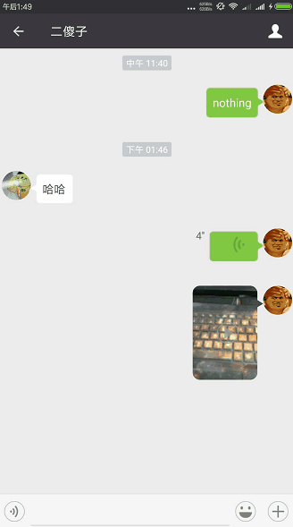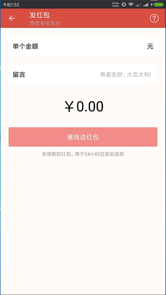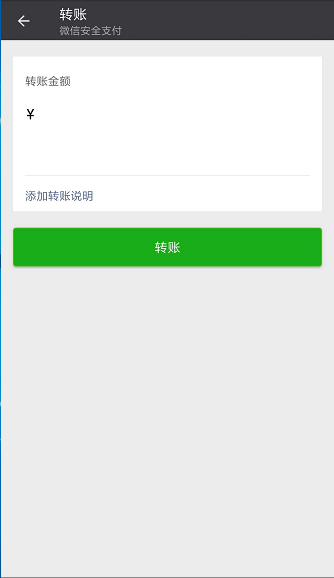

#四、之后版本将要实现的功能
1. 红包功能
2. 视频聊天
3. @别人
4. 定位、发送位置信息
5. 手机号注册、第三方登录

#五、为该项目而开发的开源库

1. LQRRecyclerViewLibrary
	
	>对RecyclerView的封装，让其使用更加简单，得心应手
	- GitHub:https://github.com/GitLqr/LQRRecyclerViewLibrary
	- 码云:https://www.oschina.net/p/lqrrecyclerviewlibrary
	
2. LQRAdapterLibrary
	
	>万能适配器（RecyclerView、ListView、GridView）
	- GitHub:https://github.com/GitLqr/LQRAdapterLibrary
	- 码云:https://www.oschina.net/p/lqradapterlibrary
	
3. LQREmojiLibrary
	
	>网易云信表情功能抽离，支持经典表情及贴图，加入仿微信软键盘切换时平滑过渡
	- GitHub:https://github.com/GitLqr/LQREmojiLibrary
	- 码云:https://www.oschina.net/p/lqremojilibrary
	
4. LQRImagePicker
	
	>完全仿微信的图片选择，并且提供了多种图片加载接口，选择图片后可以旋转，可以裁剪成矩形或圆形，可以配置各种其他的参数
	- GitHub:https://github.com/GitLqr/LQRImagePicker
	- 码云:https://www.oschina.net/p/lqrimagepicker
	
5. LQRViedoRecordView
	
	>安卓视频录制控件，可以用来仿微信小视频
	- GitHub:https://github.com/GitLqr/LQRViedoRecordView
	- 码云:https://www.oschina.net/p/lqrviedorecordview
	
6. LQRNineGridImageView
	
	>仿微信群头像九宫格控件
	- GitHub:https://github.com/GitLqr/LQRNineGridImageView
	- 码云:https://git.oschina.net/CSDNLQR/LQRNineGridImageView
	
7. LQROptionItemView
	
	>项目中常用选项条目布局控件
	- GitHub:https://github.com/GitLqr/LQROptionItemView
	- 码云:https://www.oschina.net/p/lqroptionitemview

